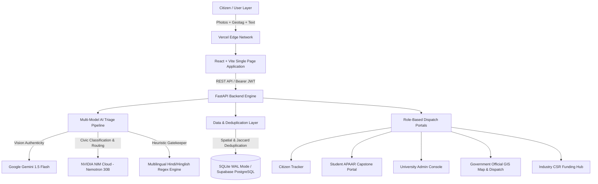

# SocioSolve: Technical Approach & Architecture Specification

A comprehensive technical breakdown of **SocioSolve**—the AI-driven grassroots civic problem ingestion, verification, and collegiate capstone routing platform designed for the Smart India Hackathon (SIH).

---

## 1. Executive Architecture Overview

SocioSolve bridges the gap between grassroots civic grievances (Panchayats, Ward Committees, Resident Welfare Associations) and academic engineering talent. It transforms routine municipal complaints into verified student capstone projects, backed by corporate CSR funding and municipal oversight.



---

## 2. Complete Technology Stack

### A. Frontend Layer
| Component | Technology | Rationale & Usage |
| :--- | :--- | :--- |
| **Core Framework** | **React 18 / 19** with **TypeScript** | Strict type safety, modular component lifecycle, maintainability. |
| **Build Tool** | **Vite 8** | Lightning-fast HMR and production bundling (**~400ms** total build time). |
| **Styling Engine** | **Tailwind CSS v3/v4** | Material 3 / Material You token system, responsive utility classes, zero runtime CSS overhead. |
| **Animation Engine** | **Framer Motion** | Fluid page transitions, responsive modals, spring-physics UI interactions. |
| **Iconography & Typography** | **Google Material Symbols** & **Plus Jakarta Sans / Inter** | Government-grade typographic hierarchy, accessible iconography. |
| **State Management** | **Zustand** + **Context API** | Lightweight global authentication store (`authStore.ts`) with session persistence. |
| **Routing** | **React Router DOM v6** | Client-side routing with SPA rewrite rules for seamless deep-linking. |
| **Spatial Graphics** | **Vector SVG Interactive Canvas** | Custom-built interactive GIS spatial console of Ranchi (12 ward polygons, River Subarnarekha curve, Ring Road bypass, dynamic pin markers). |

---

### B. Backend Layer
| Component | Technology | Rationale & Usage |
| :--- | :--- | :--- |
| **Web Framework** | **FastAPI (Python 3.10+)** | Asynchronous execution (ASGI), automatic OpenAPI/Swagger documentation, native Pydantic v2 data validation. |
| **ORM / Data Access** | **SQLAlchemy 2.0** | Object-Relational Mapping with connection pooling and database independence. |
| **Schema Migration** | **Alembic** | Version-controlled database schema migrations. |
| **Authentication** | **PyJWT (JSON Web Tokens)** | Stateless Bearer token verification supporting multi-role authentication (Citizen, Student, Official, University, Industry). |
| **Resilience & Fallback** | **Rule-based Jharkhand Civic Matrix** | Zero-downtime offline routing algorithm if cloud AI experiences network latency. |

---

### C. Artificial Intelligence & Computer Vision Layer
| AI Component | Provider / Infrastructure | Role in System |
| :--- | :--- | :--- |
| **Visual Authenticity AI** | **Google Gemini 1.5 Flash** | Evaluates uploaded photos to detect fake images, internet memes, or non-civic uploads before acceptance. |
| **Cognitive Routing & Triage** | **NVIDIA NIM (Inference Microservice)**<br>`nvidia/nemotron-3.5-lightning-30b-a3b` | Analyzes grievance descriptions to rate severity, compute priority score (0.0–1.0), extract required engineering disciplines, and suggest CSR sponsors in under **3 seconds**. |
| **JSON Healing Engine** | Custom Python Engine (`safe_parse_json`) | Self-healing parser that strips markdown fences, removes trailing commas, and handles single-quote dictionaries to guarantee zero JSON crashes. |
| **Labor vs. Capstone Classifier** | Custom Multilingual Regex Engine | Filters out physical manual municipal labor (*pothole filling, gutter desilt, gaddha, nala jam, malba*) and routes to municipal maintenance crews, while approving technical issues (*IoT, GIS, sensors, purification*) for student capstones. |
| **Spatial Deduplication Engine** | Geospatial Bounding Box + Jaccard Index | 1.5km geofencing radius + stopword-pruned keyword overlap to automatically cluster duplicate grievances. |

---

### D. Database & Storage Layer
| Component | Technology | Rationale & Usage |
| :--- | :--- | :--- |
| **Primary Production Database** | **Supabase (PostgreSQL 15)** | Managed relational database with Row Level Security (RLS) and real-time triggers. |
| **High-Concurrency Local Engine** | **SQLite with Write-Ahead Logging (WAL)** | `PRAGMA journal_mode=WAL`, `busy_timeout=30000`, `synchronous=NORMAL` providing a 10x–50x concurrency throughput boost without write locks. |
| **Object Storage** | Base64 with Cloudflare / Supabase Storage S3 | Geotagged evidence image storage with 10MB payload size enforcement. |

---

### E. Mobile & Cross-Platform Packaging
| Component | Technology | Usage |
| :--- | :--- | :--- |
| **Native Wrapper** | **Capacitor 6 / Android Studio** | Cross-platform bridge wrapping the responsive web app into an installable Android APK (`android/` project tree). |

---

## 3. Development Applications & Design Platforms Used

1. **Google Stitch**:
   - Used for initial UI/UX rapid design iteration, layout structure extraction, and semantic design system generation.
2. **Antigravity AI IDE (Google DeepMind)**:
   - Advanced agentic pair programming environment utilized to develop, refactor, audit, and test the full-stack codebase.
3. **Android Studio**:
   - Native build toolchain used to compile Capacitor assets into deployable Android packages.
4. **Vite & Node.js Toolchain**:
   - Modern JavaScript bundler and module resolver powering sub-second builds.

---

## 4. Cloud Infrastructure & DevOps Pipeline

```
[Developer Push] 
       │
       ▼
[GitHub Repository] (shad0011001100/sih-internal-hackathon-by-innovateX)
       │
       ├─────────────────────────────────┐
       ▼                                 ▼
[Vercel CI/CD Pipeline]        [FastAPI Production Server]
   - Automatic build execution    - ASGI Uvicorn Server
   - Edge network propagation     - SQLAlchemy Session Pools
   - SPA wildcard rewrites        - NVIDIA NIM / Gemini API Hooks
       │                                 │
       ▼                                 ▼
https://sociosolve-eight.vercel.app/   [Supabase / SQLite Database]
```

* **Frontend Hosting**: Hosted on **Vercel** (`https://sociosolve-eight.vercel.app/`), utilizing global CDN edge caching and custom rewrite rules in `vercel.json`.
* **AI Cloud Compute**: 
  - **NVIDIA API Catalog** (`https://integrate.api.nvidia.com/v1`) hosted on NVIDIA DGX Cloud clusters.
  - **Google AI Studio** (`https://generativelanguage.googleapis.com`) for Gemini multimodal inference.
* **Version Control**: GitHub repository with branch protection rules and continuous deployment hooks.

---

## 5. Architectural Innovations & Technical Highlights

### 1. The 3-Tier Incident Geotagging Architecture
* **Tier 1 (Citizen UI)**: Dual acquisition via browser GPS location auto-detection OR an explicit **13-Ward Administrative Dropdown** (Morabadi, Harmu, Doranda, Kishoreganj, etc.) to guarantee that no report is ever submitted without a location.
* **Tier 2 (NLP Locality Fallback)**: Backend scans text for Ranchi landmarks and matches them to latitude/longitude coordinates if GPS is unavailable.
* **Tier 3 (GIS Anchor)**: All tickets are anchored to valid spatial bounds, preventing orphaned tickets and enabling spatial clustering on the official GIS map.

### 2. Stopword-Pruned Jaccard Deduplication
Unlike naive string matchers, SocioSolve filters out common words (*"broken", "issue", "near", "road", "kharab", "karo"*) and calculates Jaccard token overlap only on meaningful nouns. This ensures two streetlights in the same ward are **not** falsely marked as duplicates, while duplicate reports for the same incident are correctly merged.

### 3. APAAR & Institutional RBAC
* Integrates the Government of India's **Automated Permanent Academic Account Registry (APAAR ID)** for student innovator verification.
* Provides dedicated portals for Government Officials (Employee ID), University Deans (Institutional Domain Email), Industry CSR Partners (Partner ID), and Citizens (Mobile OTP).
* Features **1-Click Judge Demo Logins** across all 5 roles for frictionless evaluation.

### 4. Zero-Downtime Rule-Based Fallback
If cloud AI APIs time out or hit rate limits, the backend automatically transitions to a hardcoded **Jharkhand Municipal Knowledge Matrix**, mapping issues to appropriate engineering departments and CSR partners (Tata Steel Foundation, Central Coalfields Limited) in under **10 milliseconds**.
