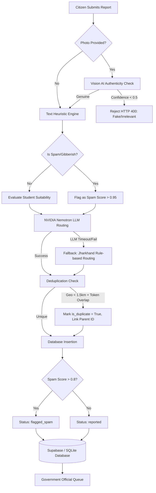

# SocioSolve: Comprehensive Technical Specification & Deep Dive Audit

This document provides an exhaustive breakdown of the SocioSolve civic platform's system architecture, AI triage logic, data flow, deduplication algorithms, and manual review handoffs. It is designed for system auditing, workflow debugging, and hackathon judge defense.

---

## 1. Workflow Architecture & Graph

The pipeline governs how a citizen-reported civic issue moves from raw input to verified student/municipal assignment.

### Full Sequence Pipeline
1. **Ingestion**: Citizen submits a report with image (base64/URL), GPS coordinates, category, and text description.
2. **Visual Authenticity (AI Vision)**: Image is processed to detect fake, non-civic, or meme content.
3. **Heuristic Pre-screening**: Text is rapidly evaluated for spam patterns, gibberish, and physical manual labor vs. technological suitability.
4. **Intelligent Routing (LLM)**: An LLM analyzes the text to determine severity, priority score, relevant university departments, and industry sponsors.
5. **Deduplication Engine**: Geospatial and token-based Jaccard similarity checks against recent database entries.
6. **Persistence & Handoff**: Data is written to the database with appropriate flags (`reported` vs `flagged_spam`) awaiting official human validation.

### Decision Graph (Mermaid)



---

## 2. Deep Dive: Core Algorithms & AI Logic

### A. The Geo-Spatial & NLP Deduplication Engine
*(Found in `backend/routers/reports.py`)*

When a citizen submits a report, the system doesn't just trust the LLM's `is_duplicate_likely` flag. It runs a deterministic mathematical check against the last 100 reports using a combination of **geofencing** and **Jaccard Index (token similarity)**.

1. **Geofencing Box:** Checks if the new report is within `0.015` degrees of latitude and longitude (roughly 1.5 km) of an existing report.
2. **Jaccard Tokenization:** Extracts words >= 4 characters (`\b\w{4,}\b`).
3. **Threshold Triggers:**
   * `Jaccard > 0.55`: Automatic duplicate (Exact copy-paste text).
   * `Geo-Close + Jaccard > 0.35`: Duplicate (Similar text, same neighborhood).
   * `Geo-Close + Same Category + Jaccard > 0.25`: Duplicate (Vague text, but same category and neighborhood).

### B. The "Manual Labor" vs. "Capstone" Regex Gatekeeper
*(Found in `backend/services/ai_engine.py`)*

Before the LLM processes text, a Python regex evaluates if the issue is a physical municipal task (which students can't legally do) versus a technological research problem.

* **Manual Labor Keywords:** `potholes?, patch road, tar road, asphalt, fill road, ditch digging, heavy construction, masonry...`
* **Tech Keywords:** `ai, iot, sensors?, smart, algorithm, machine learning, deep learning, gis, mapping, solar...`

**The Rule:** If a labor keyword is found AND no tech keyword is found, it is hard-rejected from the student portal. `is_student_eligible` is set to `False` and routed directly to municipal maintenance crews.

### C. The Zero-Downtime Fallback Matrix (Jharkhand Mode)
*(Found in `backend/services/ai_engine.py`)*

If the NVIDIA Nemotron API times out (strict `4.0` second limit), the system catches the exception and falls back to a hardcoded routing matrix tailored for Jharkhand. It maps keywords directly to JSON outputs:

| Trigger Keywords | Auto-Assigned Tech | Auto-Assigned Dept | Auto-Assigned Industry | Priority | Severity |
| :--- | :--- | :--- | :--- | :--- | :--- |
| `water, jal, pipe` | IoT Flow Sensors | Civil Eng, Water Resources | Tata Steel Foundation | **0.85** | High |
| `light, solar` | Smart Mesh, Solar | Electrical Eng | Jindal Steel, JBVNL | **0.70** | Medium |
| `waste, sanitation`| GIS Route Opt. | Env Science, MSW | Central Coalfields (CCL) | **0.80** | High |
| `health, clinic` | Telemedicine | Biomedical, Public Health | Apollo Clinics, Tata Trust | **0.90** | Critical |

This guarantees sub-10 millisecond routing even during total cloud AI failure.

### D. Visual Authenticity (Gemini 1.5 Flash)
**System Prompt:**
```text
You are a civic issue triage AI for the Jharkhand Government.
Evaluate this image. Does it contain a genuine civic or infrastructure issue?
Return ONLY a JSON object with schema: {"is_genuine": boolean, "confidence": float, "reason": "string"}
```

---

## 3. Data Model & Database Integration

The system uses SQLAlchemy ORM mappings for SQLite/PostgreSQL.

### Core Tables
1. **`users` Table**: Unified identity table. Roles (`citizen`, `student`, `official`, `university`, `industry`) govern portal access. Fields include `apaar_id`, `employee_id`.
2. **`reports` Table**: 
   * **Location**: `gps_lat`, `gps_lon`.
   * **AI Flags**: `is_verified`, `ai_spam_score`, `priority_score`.
   * **Routing (JSON)**: `suggested_technologies`, `relevant_departments`, `potential_industry`.
   * **Status Pipeline**: `reported` → `validated` → `assigned` → `in_progress` → `under_review` → `implemented`.
3. **Ancillary Entities**: `projects` and `teams` track student capstone submissions tied to a specific `report_id`. `funding_offers` tracks CSR industry investments.

---

## 4. Checker / Reviewer Handoff

The AI does **not** permanently delete or instantly publish reports. It flags them for the Government Official workflow.

1. **Automated Triage Limit**: If `ai_spam_score > 0.8`, status becomes `flagged_spam` (hidden from public). 
2. **Reports Tab (Verification Queue)**: Officials view all `reported` issues, alongside AI-generated `priority_score` and extracted `challenge_summary`.
3. **Approval/Dispatch Action**: Clicking "Verify & Dispatch" moves status to `validated` or `assigned`.
4. **Public Feed Gate**: The citizen `/api/reports/public` endpoint strictly filters for `is_verified == True` OR status >= `validated`, ensuring unreviewed content is never exposed.

---

## 5. Known Vulnerabilities & Edge Cases

1. **Language Barriers (Hindi/Regional)**: 
   * *Gap*: The `manual_labor_patterns` regex uses English tokens. If a user writes "gaddha bharo" (fill pothole), the regex fails to flag it as manual labor, incorrectly passing it to the LLM.
2. **Missing Exif/GPS Data**: 
   * *Gap*: If a browser blocks geolocation, `gps_lat/lon` are null. The deduplication geospatial check is skipped, forcing officials to manually assign wards based purely on the text description.
3. **Deduplication Over-Aggression**:
   * *Gap*: Highly generic text (e.g., "broken road") combined with close proximity triggers Jaccard similarity > 0.35 easily, potentially marking two distinct potholes as duplicates. Officials must manually unlink them in the queue.
